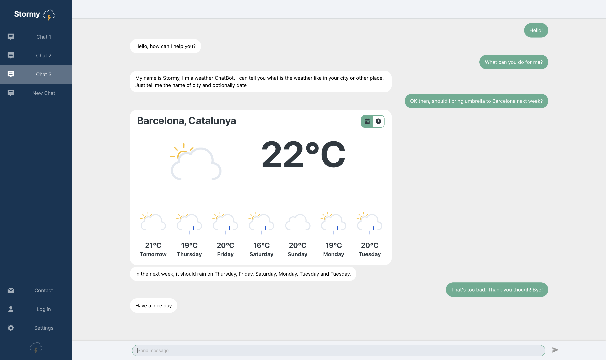

# Weather Chatbot Application Documentation 🌤️🤖

Welcome to the documentation for the Weather Chatbot application! This application allows users to interact with a contextual chatbot and retrieve weather forecasts. The frontend is built with React, while the backend utilizes Django and Firebase for database management and authentication. The application is deployed on an Amazon Web Services (AWS) Ubuntu machine, with Nginx as the reverse proxy web server. The chatbot itself is powered by a PyTorch neural network.

## Features ✨

- Chat with a Contextual Bot: Interact with a chatbot capable of understanding natural language queries.
- Weather Forecast: Retrieve weather forecasts for specified locations or use browser geolocation for automatic forecast retrieval.
- User Authentication: Sign up, log in, and log out securely to personalize your chat experience.
- Secure Database Management: Utilize Firebase for secure and efficient database management.
- Hosted Application: Access the application online at [https://fifus17.github.io/Weather-Chatbot-App/](https://fifus17.github.io/Weather-Chatbot-App/).
- Neural Network-powered Chatbot: Experience the power of PyTorch neural networks for natural language processing.

## Technologies Used 🛠️

- Frontend:
  - React - A popular JavaScript library for building user interfaces.
  - Firebase - A comprehensive platform for developing mobile and web applications, providing authentication, database, and hosting services.

- Backend:
  - Django - A high-level Python web framework for building robust and scalable web applications.
  - Firebase - Used for secure and efficient database management and user authentication.

- Deployment:
  - Amazon Web Services (AWS) - A cloud computing platform offering a wide range of services for hosting and managing applications.
  - Ubuntu - An open-source Linux distribution used as the operating system for the AWS machine.
  - Nginx - A high-performance web server and reverse proxy server.

- Machine Learning:
  - PyTorch - A popular deep learning framework used for building and training neural networks.

## Usage Instructions 🚀

Since the application is already hosted online, you can simply access it at [https://fifus17.github.io/Weather-Chatbot-App/](https://fifus17.github.io/Weather-Chatbot-App/) and start interacting with the chatbot to retrieve weather forecasts.

